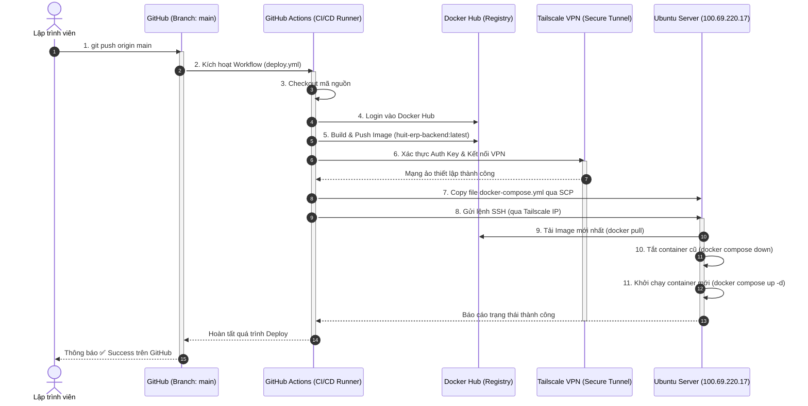

# Quy trình Deploy Tự động (CI/CD Pipeline)

Tài liệu này mô tả chi tiết kiến trúc và luồng hoạt động của hệ thống Triển khai liên tục (CI/CD) được xây dựng cho Backend HUIT ERP. Hệ thống đảm bảo tính tự động hóa cao, bảo mật tuyệt đối qua mạng riêng ảo (VPN) và không yêu cầu sự can thiệp thủ công từ lập trình viên khi cần cập nhật phiên bản mới.

## Sơ đồ luồng hoạt động (Workflow Diagram)

Sơ đồ dưới đây mô tả hành trình của mã nguồn từ lúc Lập trình viên push code cho đến khi nó được triển khai thành công trên máy chủ Ubuntu.



---

## Các thành phần chính của hệ thống

> [!NOTE]
> Hệ thống được chia thành 3 lớp chính: Lớp Đóng gói (Docker), Lớp Tự động hóa (GitHub Actions), và Lớp Bảo mật mạng (Tailscale).

### 1. Lớp Đóng gói (Docker)
* **`Dockerfile`**: Chịu trách nhiệm đóng gói mã nguồn Node.js/TypeScript. Sử dụng `node:20-alpine` làm hệ điều hành gốc nhằm tối ưu hóa dung lượng lưu trữ (siêu nhẹ) và tăng cường bảo mật (giảm bề mặt tấn công). Quá trình này sẽ loại bỏ các thư viện Native C++ không tương thích với môi trường Linux.
* **`docker-compose.yml`**: Chịu trách nhiệm khởi chạy và quản lý vòng đời của Container trên máy chủ. Điểm đặc biệt:
  * Sử dụng cấu hình `network_mode: "host"` giúp container kết nối trực tiếp với card mạng của máy chủ, giải quyết triệt để lỗi kết nối cơ sở dữ liệu (SQL Server) nằm trên dải IP của Tailscale (`100.69.220.17`).
  * Sử dụng `restart: always` giúp Backend tự động khởi động lại nếu máy chủ bị mất điện hoặc crash.

### 2. Lớp Tự động hóa (GitHub Actions)
Được định nghĩa trong file `.github/workflows/deploy.yml`. Kịch bản này được kích hoạt mỗi khi có code mới được đẩy lên nhánh `main`. Kịch bản gồm các bước:
1. Đăng nhập Docker Hub.
2. Đóng gói (Build) mã nguồn thành Image và tải (Push) lên Docker Hub.
3. Kết nối vào mạng riêng ảo.
4. Gửi cấu hình và ra lệnh cho máy chủ đích chạy ứng dụng.

### 3. Lớp Bảo mật Mạng (Tailscale VPN)
> [!IMPORTANT]
> Đây là chìa khóa để bảo mật hệ thống. Máy chủ Ubuntu của bạn không mở cổng SSH public ra Internet mà được ẩn hoàn toàn sau mạng ảo của Tailscale (IP `100.69.220.17`).

* Để GitHub Actions (vốn là một máy chủ công cộng) có thể giao tiếp với máy chủ Ubuntu của bạn, luồng CI/CD được thiết lập sử dụng `tailscale/github-action@v2` cùng với một **Reusable Auth Key**. Bước này tạm thời kết nạp máy chủ của GitHub vào mạng nội bộ của bạn trong vòng vài chục giây để thực hiện việc đẩy code, sau đó tự động ngắt kết nối.
* Truy xuất SSH được thực hiện qua công cụ `sshpass` và `scp` để vượt qua rào cản mật khẩu tự động.

---

## Hướng dẫn cấu hình lại (Nếu cần)

Trong tương lai, nếu có thay đổi về mật khẩu hoặc tài khoản, bạn cần cập nhật các biến bí mật (Secrets) trong **GitHub Repository -> Settings -> Secrets and variables -> Actions**:

| Tên Biến | Mô tả |
| :--- | :--- |
| `DOCKER_USERNAME` | Tên ID (Username) tài khoản Docker Hub của bạn. |
| `DOCKER_PASSWORD` | Access Token của Docker Hub (Tuyệt đối không dùng mật khẩu thường nếu có 2FA). |
| `TAILSCALE_AUTHKEY` | Auth Key của Tailscale (Bắt buộc phải chọn loại **Reusable** để không bị hết hạn sau 1 lần chạy). |
| `SSH_HOST` | IP Tailscale của máy chủ Ubuntu (Hiện tại: `100.69.220.17`). |
| `SSH_USERNAME` | Tên tài khoản Ubuntu (Hiện tại: `danghoa`). |
| `SSH_PASSWORD` | Mật khẩu truy cập SSH của máy chủ Ubuntu. |

> [!TIP]
> File biến môi trường `.env` chứa thông tin kết nối Database, JWT Key,... đã được đặt trực tiếp trên máy chủ Ubuntu tại thư mục `~/huit-erp-backend/.env`. Bạn không được đẩy file này lên GitHub để tránh rò rỉ dữ liệu.

---

## Quy trình Phát triển Hàng ngày (Developer Workflow)

Từ nay, vòng lặp công việc của bạn chỉ còn lại 3 bước đơn giản:
1. Sửa lỗi hoặc viết tính năng mới trên máy tính cục bộ.
2. Lưu và Push code lên GitHub:
   ```bash
   git add .
   git commit -m "Tính năng mới..."
   git push origin main
   ```
3. Hệ thống sẽ tự động làm toàn bộ mọi việc còn lại trong khoảng 1-2 phút. Ứng dụng Backend mới sẽ tự động Live mà không gây ra gián đoạn dịch vụ đáng kể nào.
