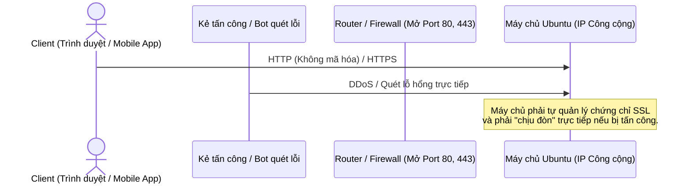
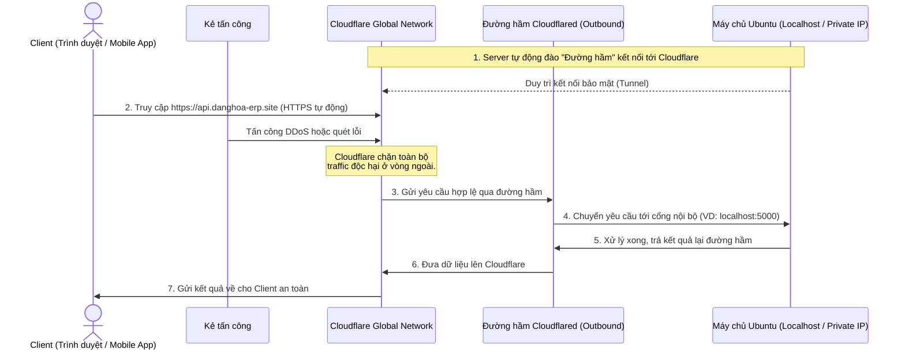

# Kiến trúc Mạng Bảo mật với Cloudflare Tunnels (Zero Trust)

Tài liệu này giải thích cơ chế hoạt động của hệ thống khi tích hợp **Cloudflare Tunnels**, giúp biến một máy chủ cục bộ (không có Public IP, không mở Port) thành một máy chủ có thể truy cập toàn cầu với chứng chỉ HTTPS bảo mật tuyệt đối.

---

## 1. Cơ chế kết nối truyền thống (Rủi ro cao)

Trong cách triển khai truyền thống, máy chủ (Server) phải có một địa chỉ IP công cộng (Public IP) và phải mở cửa (Open Port) trên Firewall/Router để đón nhận kết nối từ khách hàng (Client).

**Nhược điểm:**
- Bắt buộc phải có IP Public tĩnh (tốn thêm chi phí).
- Phải biết cấu hình mở Port (Port Forwarding / NAT).
- Dễ bị hacker quét thấy IP thật và tấn công DDoS trực tiếp.
- Phải tự thiết lập và canh gia hạn chứng chỉ SSL (Let's Encrypt, Certbot,...).

---

## 2. Kiến trúc Cloudflare Tunnels (An toàn tuyệt đối)

Với Cloudflare Tunnels (mô hình Reverse Proxy kết hợp đường hầm bảo mật), máy chủ Ubuntu của bạn **không cần mở bất kỳ Port nào** và **không cần Public IP**. 

Thay vào đó, máy chủ sẽ chạy một phần mềm nhỏ (`cloudflared`) để **chủ động tạo kết nối gửi ra ngoài (Outbound Connection)** đến trung tâm dữ liệu của Cloudflare.

### Cách luồng dữ liệu hoạt động:
1. **Khách hàng gọi vào tên miền:** Người dùng gõ `https://api.danghoa-erp.site`. Lúc này, họ thực chất đang giao tiếp với **siêu máy chủ của Cloudflare**, chứ không hề chạm đến máy chủ Ubuntu của bạn.
2. **HTTPS tự động:** Cloudflare đã gắn sẵn chứng chỉ "Ổ khóa xanh" (HTTPS/SSL) miễn phí. Mọi dữ liệu khách hàng gửi đi đều được mã hóa theo chuẩn cao nhất.
3. **Vận chuyển dữ liệu qua hầm:** Khi Cloudflare nhận được yêu cầu hợp lệ từ khách hàng, nó sẽ âm thầm tuồn dữ liệu qua "đường hầm tàng hình" để đẩy thẳng về máy chủ Ubuntu nội bộ của bạn.
4. **Máy chủ xử lý:** Ứng dụng Backend (đang chạy cổng 5000) sẽ tiếp nhận dữ liệu từ đường hầm, xử lý Database, và trả kết quả ngược lại quy trình cũ để gửi về cho khách hàng.

---

## 3. Lợi ích mang lại
- **Chống DDoS & Ẩn danh hoàn toàn:** IP gốc của máy chủ Ubuntu bị giấu kín 100%. Hacker chỉ thấy IP của Cloudflare. Nếu có tấn công, hệ thống tường lửa (WAF) khổng lồ của Cloudflare sẽ đỡ đạn thay cho bạn.
- **Không cấu hình Mạng phức tạp:** Bất chấp máy chủ bạn đặt ở đâu (kể cả dùng mạng Wifi phòng trọ không có quyền truy cập Router), miễn là máy chủ có Internet để "đào hầm" ra ngoài là hệ thống có thể chạy Live ra toàn cầu.
- **Miễn phí SSL (HTTPS) vĩnh viễn:** Quên đi nỗi lo cấu hình Certbot hay gia hạn SSL mỗi 3 tháng. Cloudflare lo từ A đến Z.
