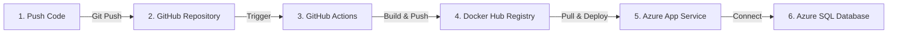

# Quy Trình Triển Khai (Deploy) Backend Lên Azure Bằng Docker

Tài liệu này hướng dẫn chi tiết từng bước để thiết lập quy trình tự động hóa đóng gói ứng dụng Backend thành Docker Image, đẩy lên Docker Hub và deploy lên Microsoft Azure App Service.

---

## Sơ Đồ Quy Trình Hoạt Động (CI/CD Pipeline)



---

## Các Bước Chuẩn Bị Ban Đầu

### Bước 1: Thiết Lập Trên Docker Hub (Kho Chứa Ảnh)
1. Đăng nhập vào [Docker Hub](https://hub.docker.com/).
2. Nhấn nút **Create Repository** và tạo một repo tên là: **`quantrinhansu-backend`**.
3. Tạo **Access Token** bảo mật để GitHub Actions đăng nhập:
   - Vào **Account Settings -> Security -> New Access Token**.
   - Đặt tên gợi nhớ (ví dụ: `GithubActions`) và nhấn **Generate**.
   - **Lưu lại mã Token** hiển thị trên màn hình.

### Bước 2: Cấu Hình Secrets Trên GitHub Repository
Để GitHub Actions có quyền truy cập và tự động đẩy ảnh lên Docker Hub:
1. Vào repository GitHub dự án Backend của bạn.
2. Chọn tab **Settings** (Cài đặt) -> **Secrets and variables** (ở cột trái) -> Chọn **Actions**.
3. Nhấp vào **New repository secret** để thêm 2 biến sau:
   - **Biến 1**:
     - Name: `DOCKER_USERNAME`
     - Value: (Tên đăng nhập tài khoản Docker Hub của bạn)
   - **Biến 2**:
     - Name: `DOCKER_PASSWORD`
     - Value: (Đoạn mã Access Token bạn đã copy ở Bước 1)

---

## Cấu Hình Triển Khai Trên Microsoft Azure

### Bước 3: Tạo Azure Web App (Chế độ Container)
1. Trên Azure Portal, nhấn **Create a resource** -> chọn **Web App**.
2. Thiết lập cấu hình cơ bản (Tab Basics):
   - **Publish**: Chọn `Container` (chạy Docker).
   - **Operating System**: Chọn `Linux`.
   - **Region**: Chọn khu vực gần bạn (ví dụ: *East Asia* hoặc *Southeast Asia*).
   - **Pricing Plan**: Chọn gói phù hợp (khuyên dùng gói **B1 - Basic** trở lên để hỗ trợ WebSocket).

### Bước 4: Cấu Hình Tải Ảnh Từ Docker Hub
1. Sau khi tạo Web App thành công, đi tới tài nguyên và chọn mục **Deployment Center** (Trung tâm triển khai) ở cột trái.
2. Tại tab **Settings**, cấu hình nguồn kéo ảnh:
   - **Source**: Chọn `Container Registry`.
   - **Registry source**: Chọn `Docker Hub`.
   - **Repository access**: 
     - Chọn `Public` (nếu repo Docker Hub của bạn là Public).
     - Chọn `Private` (nếu repo Docker Hub là Private, bạn cần điền thêm Username và Password/Access Token của Docker Hub bên dưới).
   - **Image and tag**: Điền đúng định dạng: `<tên_tài_khoản_docker_hub>/quantrinhansu-backend:latest`.
3. Nhấn **Save** (Lưu) ở phía trên cùng.

### Bước 5: Cấu Hình Các Biến Môi Trường (App Settings)
1. Vào mục **Environment variables** (hoặc **Configuration**) ở cột menu bên trái.
2. Thêm mới các biến môi trường tương tự file `.env` local của bạn:
   - `PORT` = `5000`
   - `DB_SERVER` = `quan-tri-nha-su.database.windows.net`
   - `DB_NAME` = `QuanTriNhanSu`
   - `DB_USER` = `CloudSAe02b7603`
   - `DB_PASS` = (Mật khẩu kết nối database)
   - `SECRET_KEY` = (Khóa bảo mật JWT)
   - `EMAIL_USER` = (Email gửi OTP)
   - `EMAIL_PASS` = (Mật khẩu ứng dụng của Email gửi OTP)
   - `FRONTEND_URL` = (Đường dẫn chạy Frontend của bạn ở local hoặc Vercel)
3. **CẤU HÌNH PORT CHO DOCKER (BẮT BUỘC)**:
   - Thêm một cấu hình tên là: **`WEBSITES_PORT`**
   - Giá trị điền: **`5000`** *(giúp Azure định tuyến luồng mạng vào đúng cổng 5000 của Docker container)*.
4. Nhấn **Apply** (hoặc **Save**) để lưu lại cấu hình.

### Bước 6: Bật Tính Năng WebSocket (Để dùng Chat)
1. Vào mục **Configuration** -> Chọn tab **General settings** ở phía trên.
2. Tìm dòng **Web sockets** và đổi trạng thái sang **On**.
3. Nhấn **Save** để áp dụng.

---

## Cách Vận Hành Và Kiểm Tra

### 1. Khi Cập Nhật Code
Mỗi khi bạn hoàn thành code ở local, bạn chỉ cần gõ các lệnh Git tiêu chuẩn:
```bash
git add .
git commit -m "feat: mô tả tính năng mới"
git push origin main
```
Hệ thống GitHub Actions sẽ tự động chạy tiến trình build Docker Image mới nhất, đẩy lên Docker Hub và Azure App Service sẽ tự động kéo bản mới đó về khởi chạy lại trong vòng vài phút.

### 2. Kiểm Tra Chạy Thử Ở Local Bằng Docker Desktop (Tùy chọn)
Nếu muốn test thử xem Docker chạy ở máy cá nhân của bạn thế nào trước khi đẩy lên Cloud:
1. Mở **Docker Desktop** trên máy tính.
2. Mở terminal tại thư mục Backend và build ảnh Docker:
   ```bash
   docker build -t quantrinhansu-backend:latest .
   ```
3. Khởi chạy container local bằng file `.env` sẵn có:
   ```bash
   docker run -p 5000:5000 --env-file .env quantrinhansu-backend:latest
   ```
4. Truy cập địa chỉ `http://localhost:5000/api-docs` trên trình duyệt để kiểm tra kết quả.
