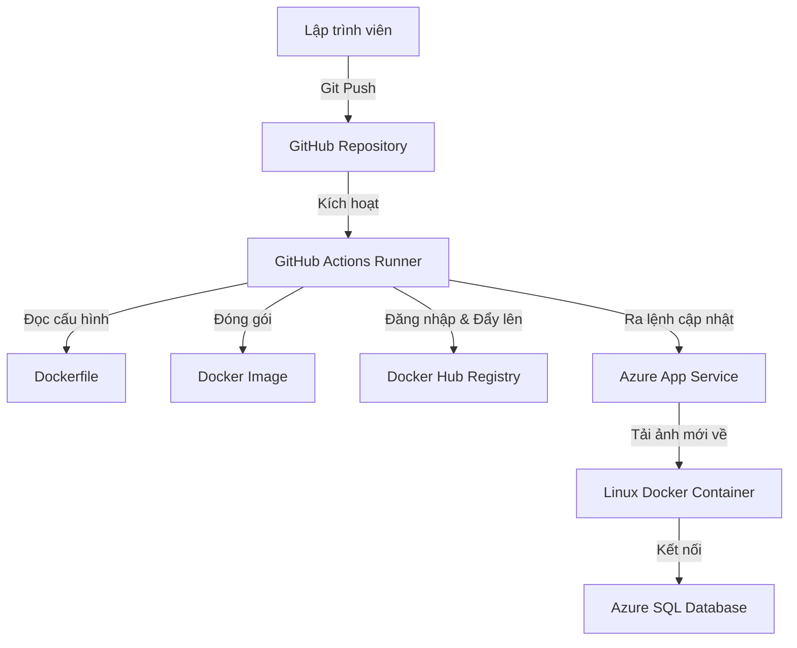

# HƯỚNG DẪN QUY TRÌNH DEPLOY CI/CD HỆ THỐNG DANGHOA-ERP BACKEND

Tài liệu này mô tả chi tiết kiến trúc, quy trình tự động hóa tích hợp và triển khai liên tục (CI/CD) của dự án DANGHOA-ERP Backend lên nền tảng đám mây Microsoft Azure thông qua Docker Container.

---

## 1. Tổng Quan Về Hệ Thống CI/CD

### CI/CD là gì?
* **CI (Continuous Integration - Tích hợp liên tục):** Là quá trình tự động kiểm tra, build (biên dịch) mã nguồn và đóng gói phần mềm ngay khi lập trình viên đẩy code mới lên kho chứa (GitHub).
* **CD (Continuous Deployment - Triển khai liên tục):** Là quá trình tự động lấy sản phẩm đã đóng gói thành công ở bước CI và triển khai (deploy) trực tiếp lên máy chủ môi trường chạy thực tế (Production) mà không cần can thiệp thủ công.

### Lợi ích đối với dự án:
* **Tự động hóa hoàn toàn:** Chỉ cần `git push origin main`, ứng dụng sẽ tự động được cập nhật trên Azure sau 2-3 phút.
* **Môi trường đồng nhất:** Docker đóng gói mọi thứ (hệ điều hành, thư viện hệ thống, node modules) thành một Image thống nhất. Giúp loại bỏ hoàn toàn lỗi "chạy được ở máy tôi nhưng lỗi ở server".
* **Độ tin cậy cao:** Giảm thiểu sai sót của con người trong quá trình cấu hình, cài đặt thủ công trên server.

---

## 2. Kiến Trúc Triển Khai (Deployment Architecture)

Mô hình hoạt động của luồng CI/CD trong dự án:

Các thành phần tham gia:
1. **GitHub Repository:** Nơi lưu trữ mã nguồn chính thức của dự án.
2. **GitHub Actions (CI/CD Engine):** Máy chủ ảo chạy ngầm của GitHub, chịu trách nhiệm thực thi các bước trong file workflow `.yml`.
3. **Docker Hub:** Kho chứa ảnh Docker (Registry) để lưu trữ phiên bản đóng gói của ứng dụng (`danghoa578/quantrinhansu-backend`).
4. **Azure App Service (Linux Web App):** Máy chủ chạy container của Microsoft Azure, tự động tải ảnh từ Docker Hub về và chạy ứng dụng.
5. **Azure SQL Server:** Cơ sở dữ liệu của hệ thống kết nối trực tiếp với Backend.

---

## 3. Quy Trình Tự Động Hóa Chi Tiết (CI/CD Pipeline Flow)

Quy trình tự động hóa được định nghĩa trong file cấu hình `.github/workflows/main_quantrinhansu-backend.yml` gồm 2 giai đoạn (Jobs) chính:

### Giai đoạn 1: Build (Tích hợp liên tục)
1. **Checkout Code:** Tải mã nguồn mới nhất từ nhánh `main` xuống máy chủ ảo của GitHub.
2. **Set up Docker Buildx:** Khởi tạo môi trường build Docker nâng cao.
3. **Log in to Docker Hub:** Đăng nhập vào tài khoản Docker Hub sử dụng cặp Secret:
   * `${{ secrets.DOCKER_USERNAME }}` (Username: `danghoa578`)
   * `${{ secrets.DOCKER_PASSWORD }}` (Access Token có quyền Read/Write/Delete)
4. **Build & Push:** Biên dịch ứng dụng theo thiết kế trong `Dockerfile` và đẩy (push) ảnh lên Docker Hub với tag duy nhất gắn theo mã định danh commit (`${{ github.sha }}`).

> [!NOTE]
> **Đặc điểm của Dockerfile dự án:**
> * Sử dụng base image `node:20-slim` (môi trường Linux Debian).
> * Tự động tải và cấu hình **Microsoft ODBC Driver 17 cho SQL Server**. Đây là yêu cầu bắt buộc để thư viện kết nối SQL Server native (`msnodesqlv8`) có thể chạy được trên Linux.
> * Biên dịch code TypeScript (`tsc`) sang JavaScript (`dist/`).
> * Mở cổng mạng (Expose port) `5000`.

### Giai đoạn 2: Deploy (Triển khai liên tục)
1. **Login to Azure:** Đăng nhập an toàn vào tài khoản Microsoft Azure bằng Service Principal (thông qua các khóa bảo mật được cấp từ Azure: Client ID, Tenant ID, Subscription ID).
2. **Deploy to Azure Web App:** Sử dụng hành động `azure/webapps-deploy@v2` để chỉ định cho Azure App Service (`QuanTriNhanSu-BackEnd`) tải đúng bản Docker Image vừa được push lên Docker Hub về để chạy.

---

## 4. Các Cấu Hình Quan Trọng Cần Duy Trì

Để hệ thống hoạt động ổn định, các cấu hình sau trên GitHub và Azure phải được duy trì chính xác:

### A. GitHub Repository Secrets
Nằm tại: `Settings -> Secrets and variables -> Actions -> Repository secrets`

* **`DOCKER_USERNAME`:** Tên đăng nhập Docker Hub (`danghoa578`).
* **`DOCKER_PASSWORD`:** Personal Access Token của Docker Hub (có quyền Đọc & Ghi).
* **`AZUREAPPSERVICE_CLIENTID_...`:** ID định danh ứng dụng kết nối Azure.
* **`AZUREAPPSERVICE_TENANTID_...`:** ID định danh Azure Directory.
* **`AZUREAPPSERVICE_SUBSCRIPTIONID_...`:** ID gói đăng ký Azure.

### B. Azure App Service Environment Variables (Biến môi trường)
Nằm tại: `Settings -> Environment variables` của App Service `QuanTriNhanSu-BackEnd` trên Azure Portal.

* **`WEBSITES_PORT` = `5000`:** Chỉ thị bắt buộc để Azure định tuyến traffic từ cổng 80/443 ngoài Internet vào cổng `5000` của container Node.js.
* **Cấu hình DB:** `DB_USER`, `DB_PASS`, `DB_SERVER`, `DB_NAME`, `DB_MASTER` để ứng dụng kết nối tới cơ sở dữ liệu SQL Server.
* **Cấu hình bổ sung:** `SECRET_KEY`, `ENCRYPTION_KEY`, `EMAIL_USER`, `EMAIL_PASS`, `FRONTEND_URL` phục vụ cho mã hóa dữ liệu, JWT auth và gửi mail.

---

## 5. Hướng Dẫn Bảo Trì & Xử Lý Sự Cố (Troubleshooting)

### 1. Xem nhật ký chạy của container (Log Stream)
Khi trang web báo lỗi `Application Error`, hãy vào Azure Portal -> Chọn App Service -> **Log stream** (Luồng nhật ký) dưới mục **Monitoring**. Tại đây, toàn bộ lỗi crash hoặc kết nối của Node.js sẽ được hiển thị trực quan theo thời gian thực.

### 2. Lỗi kết nối Cơ sở dữ liệu (Connection Timeout)
* **Triệu chứng:** Container khởi động liên tục và dừng ở bước kết nối SQL Server.
* **Cách sửa:** Vào Azure SQL Server -> Mục **Networking** (hoặc **Firewalls and virtual networks**) -> Đảm bảo lựa chọn **`Allow Azure services and resources to access this server`** đã được bật (Set thành **Yes**).

### 3. Lỗi xác thực Docker Hub (401 Unauthorized)
* **Triệu chứng:** Job build trên GitHub Actions thất bại ở bước push ảnh.
* **Cách sửa:** Tạo mới Personal Access Token trên Docker Hub với quyền `Read & Write` và cập nhật lại vào phần `DOCKER_PASSWORD` trên GitHub Secrets.
