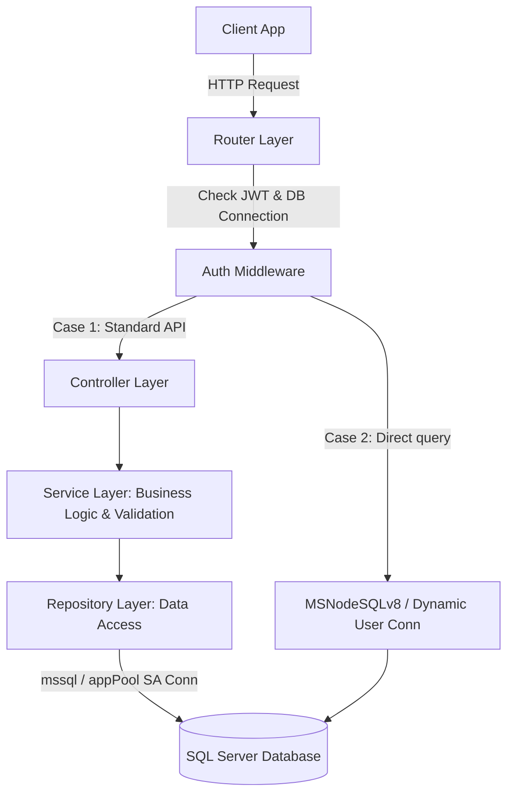

# Phân Tích Kiến Trúc Backend DANGHOA-ERP

Tài liệu này tóm tắt kết quả nghiên cứu và phân tích cấu trúc mã nguồn dự án **DANGHOA-ERP (Hệ thống Quản trị Nhân sự)** nhằm chuẩn bị cho việc thực hiện các task phát triển và sửa lỗi tiếp theo.

---

## 🎯 Tổng Quan Công Nghệ (Tech Stack)

*   **Runtime**: Node.js với TypeScript.
*   **Framework**: Express.js (v5.2.1).
*   **Database**: SQL Server 2019 (MSSQL) kết hợp với Stored Procedures và Views.
*   **Realtime**: Socket.IO (v4.8.3) cho module Chat và Realtime Dashboard.
*   **Mã hóa & Bảo mật**: JWT, `bcryptjs`, và `crypto-js` (AES).
*   **Tiện ích gửi mail**: `nodemailer` (gửi mã OTP đăng ký).

---

## 🏗️ Kiến Trúc Hệ Thống & Luồng Xử Lý

Dự án áp dụng mô hình kiến trúc **3 lớp (3-Layer Architecture)** kết hợp với một số API inline viết trực tiếp trong router:



### 1. Router Layer (`routers/`)
Định nghĩa các endpoint RESTful và áp dụng middleware:
*   `withUserConnection`: Xác thực JWT và khởi tạo chuỗi kết nối động.
*   `requireAdmin`: Kiểm tra quyền quản trị viên (Admin check).

### 2. Controller Layer (`controllers/`)
Nhận request từ router, trích xuất tham số (`req.params`, `req.body`), gọi Service tương ứng, bắt lỗi (`try-catch`) và trả về HTTP Response theo định dạng chuẩn:
```json
{
  "success": true,
  "data": { ... },
  "message": "Thông điệp phản hồi"
}
```

### 3. Service Layer (`services/`)
Nơi xử lý **logic nghiệp vụ chính (Business Logic)**:
*   Kiểm tra tính hợp lệ của dữ liệu đầu vào (Validation) trước khi lưu trữ.
*   Thực hiện các phép tính toán (ví dụ: tính lương thực lĩnh).
*   Gọi Repository để thao tác dữ liệu.
*   *Lưu ý*: Không viết logic nghiệp vụ trong Repository hay Controller.

### 4. Repository Layer (`repositories/`)
Lớp truy xuất dữ liệu duy nhất (**Data Access Layer - DAL**):
*   Gọi các SQL Query hoặc Stored Procedures.
*   Không chứa logic nghiệp vụ.

---

## 🔐 Cơ Chế Kết Nối Database Kép (Hybrid DB Connection)

Đây là điểm đặc thù lớn nhất của dự án DANGHOA-ERP:

### Cách 1: Kết nối Tĩnh qua Connection Pool (`appPool`)
*   Sử dụng cấu hình tài khoản hệ thống (thường là quyền admin `sa`) từ file `.env`.
*   Sử dụng thư viện `mssql`.
*   Áp dụng cho các tác vụ nghiệp vụ chuẩn đi qua Service và Repository (ví dụ: CRUD phòng ban, nhân viên, tính lương).

### Cách 2: Kết nối Động theo Phiên Đăng Nhập (`req.userConnectionString`)
*   Mỗi khi nhân viên đăng ký tài khoản, hệ thống sẽ tự động tạo một **Database User** riêng trong SQL Server thông qua Dynamic SQL (`CREATE USER ... WITH PASSWORD ...`).
*   Khi đăng nhập thành công, mật khẩu SQL của Database User đó được mã hóa bằng AES và đóng gói vào token JWT.
*   Tại middleware `withUserConnection`, hệ thống giải mã mật khẩu này và sinh ra một **Connection String động** (`req.userConnectionString`) để kết nối trực tiếp dưới quyền của DB User đó.
*   Sử dụng thư viện `msnodesqlv8` để chạy các câu lệnh trực tiếp trong Router (ví dụ: truy vấn đồng nghiệp `/coworkers/:maphg` hoặc xem dự án tham gia `/my-projects/:manv`).
*   **Mục đích**: Tận dụng cơ chế phân quyền Row-level Security hoặc DB User-level Security trực tiếp trên database SQL Server.

---

## ⚠️ Những Điểm Mấu Chốt Cần Lưu Ý Khi Code (Critical Gotchas)

> [!WARNING]
> **1. Bất nhất trong đặt tên khóa (Key Naming):**
> *   Database SQL Server sử dụng kiểu in hoa và dấu gạch dưới (`MAPHG`, `MANV`, `HOTEN`).
> *   Mã nguồn TypeScript sử dụng kiểu camelCase (`maphg`, `maNv`, `hoTen`).
> *   Khi lấy kết quả từ `recordset` của database, phải sử dụng đúng tên cột in hoa của SQL (ví dụ: `d.MAPHG` thay vì `d.maphg`), nếu không sẽ bị nhận giá trị `undefined`.

> [!IMPORTANT]
> **2. Luồng đăng ký nhân sự mới (Onboarding Flow):**
> *   Nhân viên đăng ký tài khoản -> Nhận mã OTP qua email -> Xác thực OTP thành công -> Hồ sơ được đưa vào bảng `DANG_KY_CHO` với trạng thái `PENDING_OTP` / `APPROVED`.
> *   Tài khoản chỉ thực sự được kích hoạt khi Admin duyệt hồ sơ bằng API `/api/admin/onboarding/accept`. Lúc này hệ thống mới tạo DB User và chuyển thông tin sang bảng `NHAN_VIEN` chính thức.

> [!TIP]
> **3. Bảo mật truy vấn SQL:**
> *   Luôn sử dụng tham số hóa truy vấn thông qua `.input()` của thư viện `mssql` hoặc truyền mảng tham số `?` đối với `msnodesqlv8`.
> *   Tuyệt đối không cộng chuỗi SQL (`string concatenation`) để ngăn ngừa SQL Injection.

---

## 📂 Danh Sách Các Module Nghiệp Vụ & File Quan Trọng

| Module | Chức năng chính | Các file cốt lõi |
| :--- | :--- | :--- |
| **Authentication** | Đăng ký, OTP email, duyệt onboarding, login JWT | `authRoutes.ts`, `authController.ts`, `authService.ts`, `authMiddleware.ts` |
| **Employee** | CRUD nhân sự, tính giờ làm việc | `employee.ts` (routes), `employeeController.ts`, `employeeService.ts`, `employeeRepository.ts` |
| **Department** | CRUD phòng ban, phân công trưởng phòng | `departmentRoutes.ts`, `departmentController.ts`, `departmentService.ts`, `departmentRepository.ts` |
| **Payroll** | Tính lương tháng, phụ cấp, bảo hiểm, chốt bảng lương | `payrollRoutes.ts`, `payrollService.ts`, `payrollRepository.ts` |
| **Project** | Tạo dự án, phân công nhân sự vào dự án | `projectRoutes.ts`, `projectController.ts`, `projectService.ts`, `projectRepository.ts` |
| **Chat** | Realtime chat phòng ban, nhóm, 1-1 qua Socket.io | `chatRoutes.ts`, `chatSocket.ts`, `chatController.ts`, `chatService.ts`, `chatRepository.ts` |
| **Dashboard** | Thống kê tổng số lượng nhân viên, dự án, phòng ban | `dashboardRoutes.ts`, `dashboardController.ts`, `dashboardService.ts`, `dashboardRepository.ts` |
| **Database Setup** | Định nghĩa SPs, views, trigger | `database/Nhom8.sql`, `database/Trigger/` |
